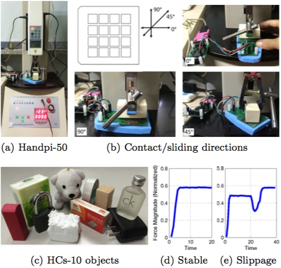

## Haptic dataset HCs10 with a demo using LDS-toolbox

This repo contains a tactile dataset named HCs-10 with a simple demo using [LDS-toolbox](https://github.com/huangwb/LDS-toolbox).

### About the tactile sensor in use

Up till nowadays, there have been two typical designs in flexible capacitive tactile sensor; and the difference between them mainly lies in the selection of dielectric layer: one uses air gap, while the other uses Polydimethylsiloxane (PDMS). In [the paper of Zhang et al.](https://link.springer.com/chapter/10.1007/978-981-10-5230-9_31), the PDMS dielectric layer is improved by the micro needle structure, therefore inheriting and synthesizing both the advantages of the capacitive sensors with air gap and that with PDMS layers. 

### How is HCs10 constructed?

The HCs-10 dataset was gathered from the aforementioned new type of capacitive tactile sensor array, several prototypes of which were recently made by Zhang et al. The single cell size in the fabricated 4 X 4 sensors array is 0.7 X 0.5 squared cm. As presented in Fig.c below, we tested 10 objects with different surface properties, such as wood, metal, cloth, plastic, and foam. 

In order to make the objects exerting exactly the same force against the capacitive sensor, we used Handpi electronic test stand with a dynamometer mounted on a docking shelf (Fig.a below), which can move vertically with an adjustable speed. The object was fastened at the tail of the force gauge with a clamp and is moved down towards the sensor with a small fixed speed. The data was logged from the initial contact until the dynamometer stopped pressing the sensor, when normal force measured by the dynamometer reached exactly 5 Newton. We placed each object in three directions as shown in Fig.b below; and we repeated 3 times for each direction, resulting in 9 sequences for each object. 

To make the task more challenging, for each object, we conducted another 9 tests with the same configurations; but as soon as the dynamometer stopped, a horizontal force *P* was applied in the same object direction to cause an object slippage. We hence have 18 tactile sequences (9 stable + 9 slippage) collected for each object class. From the perspective of a single tactile unit, a trough of the force value often occurs in case of object slippage (e.g. Fig.e), which a stable contact (e.g. Fig.d) does not have.


   
An illustration of collecting the HCs-10 dataset:

>(a) The Handpi-50 electronic test stand with a dynamometer installed.   
>(b) Demonstration of three directions (i.e. 0 degree, 90 degree, and 45 degree) of object placement.   
>(c) Ten objects in HCs-10 dataset: 1-*wood block*, 2-*white tape*, 3-*metal lock*, 4-*rubber stamp*, 5-*cloth bear*, 6-*plastic charger*, 7-*tissue pack*, 8-*glass bottle*, 9-*staple box*, 10-*white foam.   
>(d) Single unit output in case of a stable contact. (e) Single unit output in case of a slippage right after the contact.

### An example of using this dataset

The transformed dataset is in ```./dataset/haptic_hcs10/hcs10-trans.mat```. The data are stored in the matlab cell format. Different cells represent different sequences. Each sequence is restored by the *s* X *t* matrix, where *s* and *t* are the spatial and temporal dimensions, respectively.

Linear Dynamical Systems (LDSs) are fundamental tools for modeling spatiotemporal data in various disciplines. We use this toolbox to demo a simple use case. To learn stable LDS tuples (A,C) from any tactile sequence, please run demo_hcs10.m.


### Citation

If you use HCs10 dataset, please cite in BibTex format:

>@inproceedings{cao2016efficient,  
  title={Efficient spatio-temporal tactile object recognition with randomized tiling   convolutional networks in a hierarchical fusion strategy},  
  author={Cao, Lele and Kotagiri, Ramamohanarao and Sun, Fuchun and Li, Hongbo and Huang, Wenbing and Aye, Zay Maung Maung},  
  booktitle={AAAI Conference on Artificial Intelligence (AAAI)},  
  pages={3337--3345},  
  year={2016}}

If you make use of this toolbox in your work, please cite the following papers:

   >@inproceedings{huang2017efficient,   
         title={Efficient Optimization for Linear Dynamical Systems with Applications to Clustering and Sparse Coding.},   
         author={Huang, Wenbing and Mehrtash, Harandi and Tong, Zhang and Lijie, Fan and Fuchun, Sun and Junzhou, Huang},   
         booktitle={Advances in Neural Information Processing Systems (NIPS)}, 
         pages={3446--3456},   
         year={2017}} 

   >@inproceedings{wenbing2016sparse, 
         title={Sparse coding and dictionary learning with linear dynamical systems},   
         author={Huang, Wenbing and Sun, Fuchun and Cao, Lele and Zhao, Deli and Liu, Huaping and Harandi, Mehrtash},   
         booktitle={IEEE Conference on Computer Vision and Pattern Recognition (CVPR)},   
         pages={3938--3947},   
         year={2016}, 
         organization={IEEE}} 

   >@inproceedings{huang2015scalable,   
         title={ Learning Stable Linear Dynamical Systems with the Weighted Least Square Method.},   
         author={Huang, Wenbing and Cao, Lele and Sun, Fuchun and Zhao, Deli and Liu, Huaping and Yu, Shanshan},   
         booktitle={Proceedings of the International Joint Conference on Artificial Intelligence (IJCAI)},   
         pages={1599--1605},   
         year={2016}}


